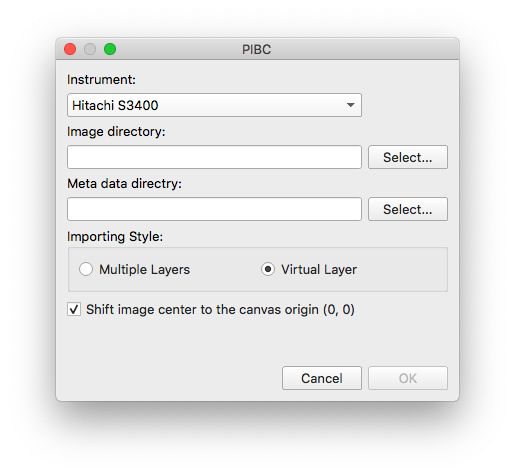
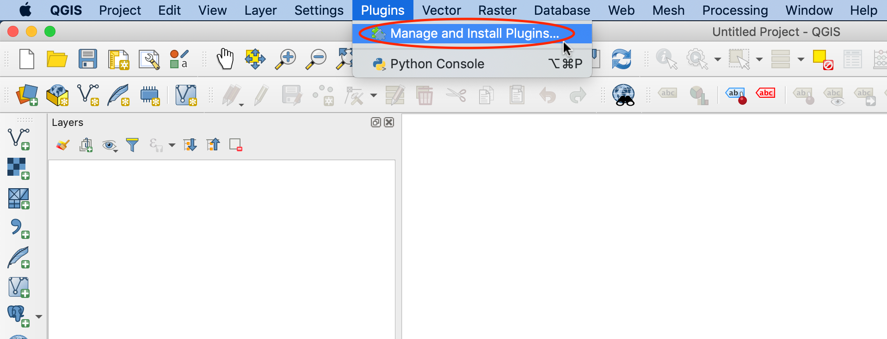
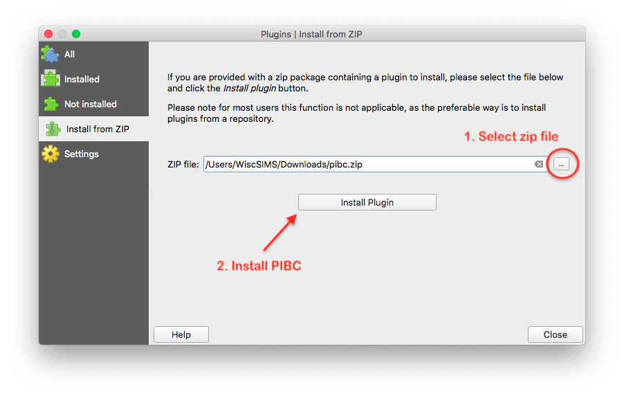

# PIBC (Place Images By Coordinates)

A QGIS plugin to place images to the QGIS canvas by coordinates.

Coordinates of image can be provided by matafile or metadata embedded in each image. You can write a definition file for your instruments to parse and provide metadata (coordinates and pixel size) to `PIBC`

## Requirements

- QGIS (ver. 3.10+)

## Installation

There are two ways to install `PIBC`.

### 1. Install from QGIS Plugin Repository

1. Open QGIS.

2. From the QGIS menu, select `Plugins` > `Manege and Install Plugins`.
   

3. Select the `All` tab on the far left. Search/find `PIBC` from the plugin list and click `Install Plugin` button on the right bottom of `Manege and Install Plugins` window.
   

4. Select `Installed Plugins` to make sure `PIBC` was correctly installed. If it is not checked, click the checkbox (on the left of green puzzle piece icon) to activate the plugin. You also see `PIBC` icon in the QGIS toolbar.

### 2. Install from ZIP file

Manual installation is also available.

1. Download `PIBC` (pibc.zip) from [WiscSIMS GitHub repository](https://github.com/wiscsims/pibc/releases/latest).

2. Open QGIS.

3. From the QGIS menu, select `Plugins` > `Manege and Install Plugins`.
   

4. Select `Intall from ZIP` and hit `...` button to select downloaded `pibc.zip` file.
   

5. Hit `Install Plugin` to install `PIBC`.
6. Select `Installed Plugins` to make sure `PIBC` was correctly installed. You also see `PIBC` icon in the QGIS toolbar.

## Quick Start

1. Activate **`PIBC`** by clicking plugin button
1. Select instrument type
1. Select a folder for SEM images
1. Select a folder for meta files
1. Select layer style (separated layers or virtual/single layer)
1. Click `OK` > > > > > > > 🎉

## Features

_TBU_

### metadata

`PIBC` reads metadata of the images which are going to be placed by metafile or embedded metadata in each image.

### scale

PIBC handles 1 µm as 1 map-unit in QGIS.

### ToDo

- [ ] Definition file for each SEM (instruments)
- [ ] (Auto) correction of stage backlash
